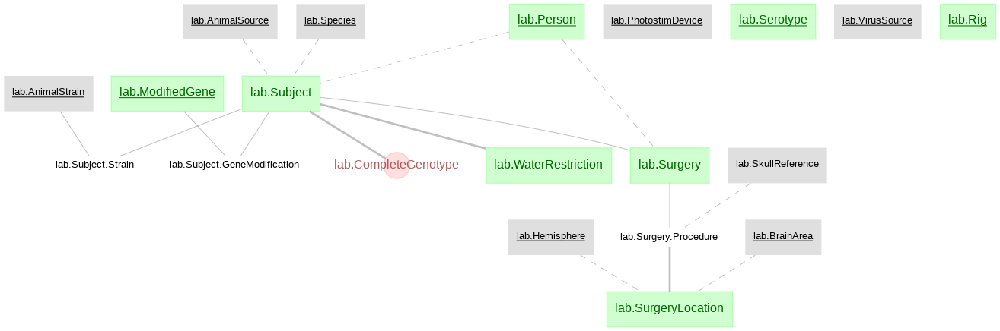
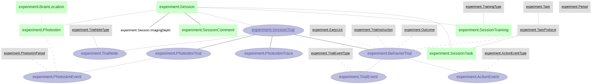
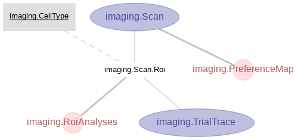

# Li-2015b

This notebook replicates Figure 4 in Li et al., (2015). **"A motor cortex circuit for motor planning and movement."**

Publication link: https://doi.org/10.1038/nature14178
Original data link: https://dx.doi.org/10.6080/K0MS3QNT

This study revealed the flow of information within motor cortex circuits involved in converting preparatory activity into movements. One important part of the motor cortex is known as anterior later motor cortex (ALM), which has been shown to involve in planing directed licking. Projection neurons in ALM include two major classes: intratelencephalic (IT) neurons that project to other cortical areas and pyramidal tract (PT) neurons that project out of the cortex, including to motor-related areas in the brainstem. Results in Figure 4, in particular, characterized the selectivity and preference of PT and IT neurons in ALM L5 on the population level.

## Schema structure

The `lab` schema:

The `experiment` schema:

The `imaging` schema:

